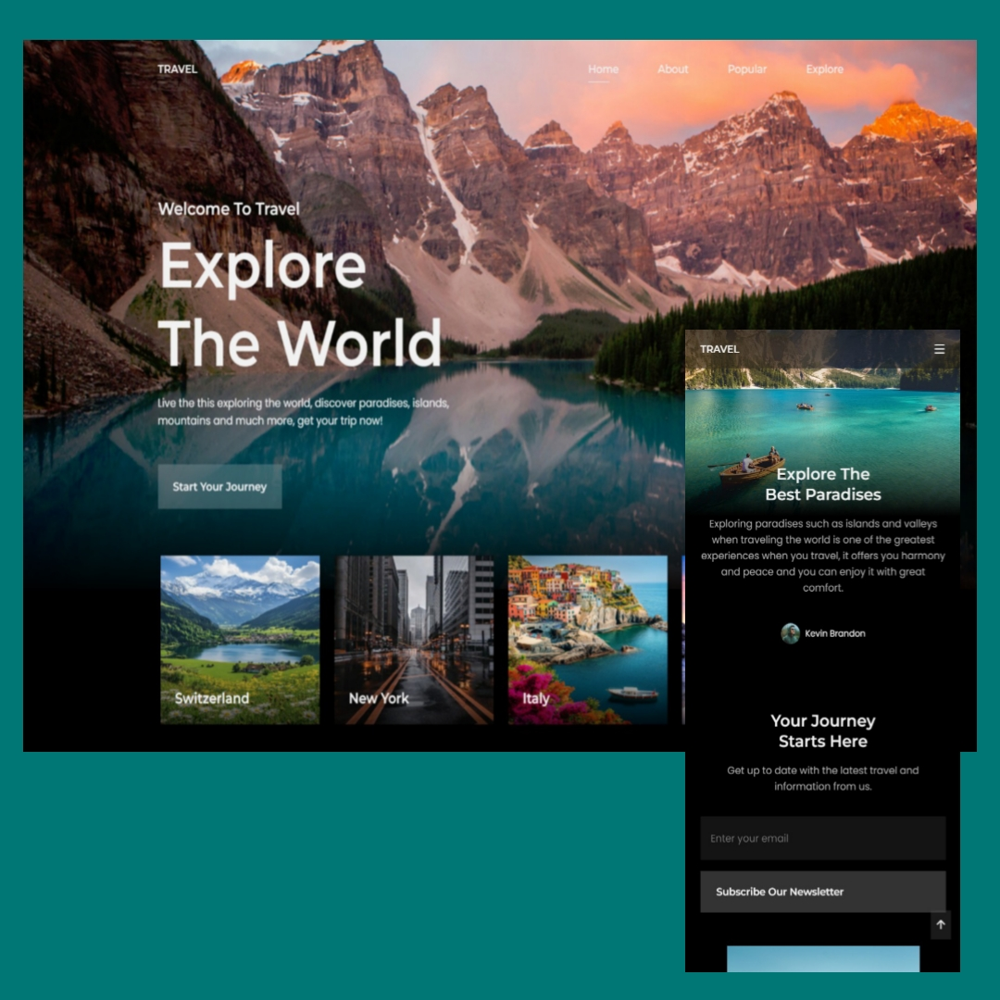

# 🌍 Travel Site – Página de viajes moderna

Sitio web de viajes desarrollado con **HTML**, **CSS** y **JavaScript**. Cuenta con un diseño moderno, completamente responsive y con interacciones suaves que mejoran la experiencia del usuario. Ideal para promocionar destinos turísticos y atraer a viajeros.

## 🧩 Detalles

- 📱 Diseño responsive: se adapta a dispositivos móviles, tablets y escritorio.
- ✨ Animaciones suaves y transiciones modernas.
- 📸 Sección de destinos destacados con imágenes llamativas.
- 🔍 Navegación clara e intuitiva.
- ☀️ Estética limpia y atractiva para sitios turísticos.

## ⚙️ Tecnologias
- HTML
- CSS3
- JavaScript

## 🖼️ Vista previa
  

## 🔗 Enlace al sitio

➡️ [Ver sitio en línea](https://explore-the-world-site.netlify.app/)

